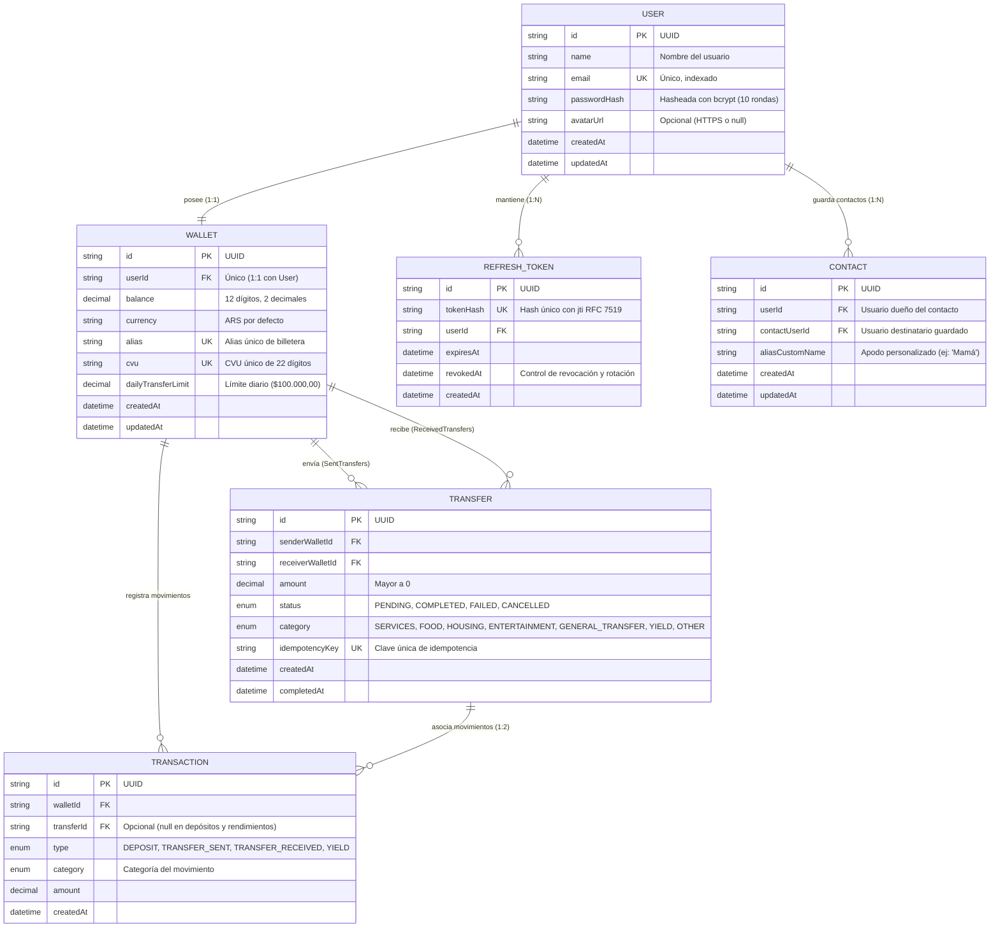
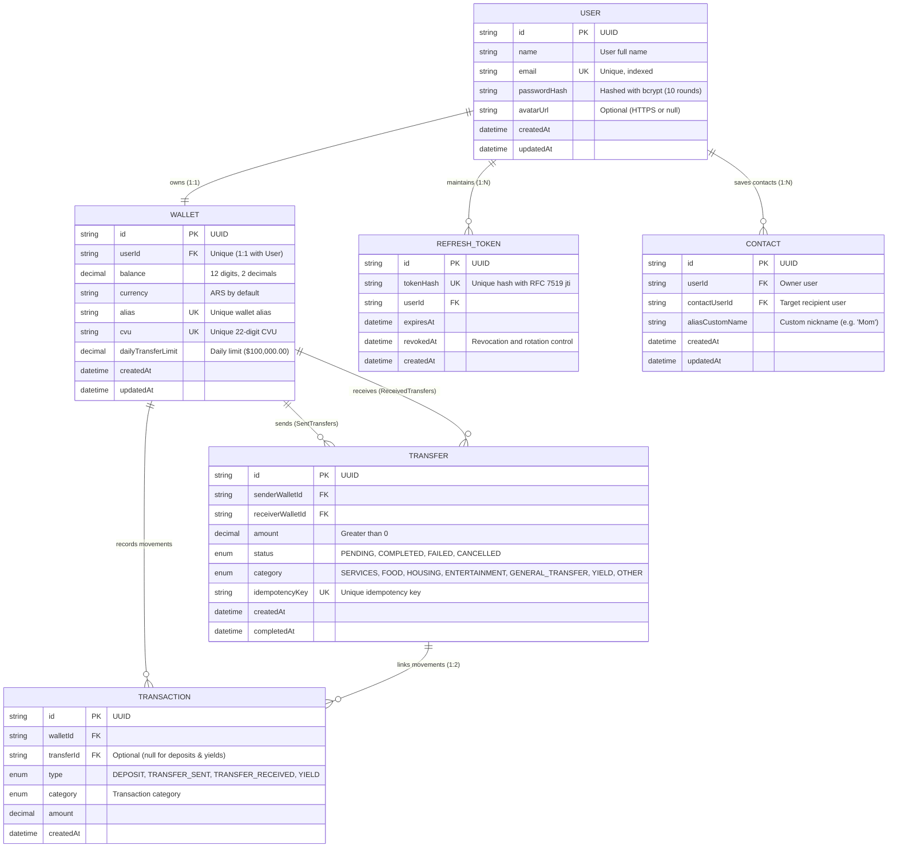

# 💳 MiniPay — Wallet API

> **[Español](#-español)** | **[English](#-english)**

---

## 🇪🇸 Español

API RESTful para una **Billetera Digital con Dinero Ficticio**, desarrollada como Proyecto Integrador Backend de nivel producción utilizando **NestJS 11**, **TypeScript**, **PostgreSQL 16** y **Prisma ORM**.

El sistema implementa operaciones financieras de alta concurrencia garantizando **Consistencia ACID**, **Atomicidad Transaccional**, **Idempotencia de Peticiones**, **Cobros con Códigos QR Criptográficos**, **Comprobantes Oficiales en PDF con Sello SHA-256**, **Motor de Rendimientos Diarios (35% TNA)**, **Categorización de Gastos y Estadísticas**, **Agenda de Contactos**, **Filtros Globales de Seguridad y Sanitización**, y **Autenticación JWT con Rotación Estricta de Tokens**.

---

### 🚀 Stack Tecnológico

| Componente | Tecnología | Descripción |
| :--- | :--- | :--- |
| **Framework** | [NestJS 11](https://nestjs.com/) | Arquitectura modular desacoplada con Inyección de Dependencias |
| **Lenguaje** | [TypeScript](https://www.typescriptlang.org/) | Tipado estricto en tiempo de compilación |
| **Base de Datos** | [PostgreSQL 16](https://www.postgresql.org/) | Base de datos relacional ACID ejecutada en Docker |
| **ORM** | [Prisma 7](https://www.prisma.io/) | Con `@prisma/adapter-pg` y pool de conexiones `pg` |
| **Seguridad** | Passport JWT, bcrypt, Helmet, CORS, Throttler | Hashing seguro (10 rondas), cabeceras HTTP, rate limiting |
| **Criptografía** | HMAC-SHA256, `crypto.timingSafeEqual` | Firma digital de pagos QR con mitigación de ataques de temporización |
| **Documentos** | PDFKit & StreamableFile | Generación de comprobantes en memoria con sello SHA-256 |
| **Serialización** | ClassSerializer & Sanitizer | Depuración automática y recursiva de contraseñas |
| **Documentación** | OpenAPI 3.0 / Swagger UI | Explorador interactivo en `/api/docs` |
| **Testing** | Jest + Supertest | Suite de pruebas de integración End-to-End (**70/70 tests**) |
| **API Client** | Postman Collection v2.1.0 | Colección completa con scripts de persistencia de tokens |
| **Gestor de Paquetes** | [pnpm](https://pnpm.io/) | Rápido y eficiente en espacio de disco |

---

### 🏛️ Arquitectura y Modelo de Datos



---

### 🧠 Decisiones Técnicas y Desafíos Resueltos

#### 1. Atomicidad Transaccional en Transferencias (`prisma.$transaction`)
- El débito del remitente (`balance: { decrement: amount }`), el crédito del destinatario (`balance: { increment: amount }`), el registro `Transfer` y los asientos en `Transaction` (`TRANSFER_SENT` y `TRANSFER_RECEIVED`) se ejecutan dentro de una **transacción interactiva atómica**.
- Si cualquiera de los pasos falla o el saldo resulta insuficiente, se ejecuta un **Rollback automático**.

#### 2. Sistema de Idempotencia y Prevención de Replay Attacks
- El endpoint `POST /transfers` acepta la cabecera `Idempotency-Key`.
- Si la red reintenta una petición con la misma clave y los mismos datos, devuelve inmediatamente el resultado de la transferencia previa **sin duplicar el débito**. Reutilizar una clave previa con datos distintos se rechaza con `400 Bad Request`.
- En cobros QR, el identificador único `qrId` actúa como clave de idempotencia atómica: cualquier intento de pagar un QR ya cobrado responde inmediatamente con `409 Conflict`.

#### 3. Pagos con Códigos QR Criptográficos (HMAC-SHA256)
- **Generación:** `POST /transfers/qr/generate` crea un payload firmado digitalmente con HMAC-SHA256, expiración estricta de 15 minutos (TTL) y datos del cobro.
- **Verificación en tiempo constante:** `POST /transfers/qr/pay` valida la firma utilizando `crypto.timingSafeEqual` con verificación previa de `byteLength` para prevenir ataques de temporización (timing attacks).
- **Decodificación / Preview:** `POST /transfers/qr/decode` permite al usuario pagador previsualizar el monto y destinatario antes de confirmar.

#### 4. Motor de Cuenta Remunerada (35% TNA)
- Distribución diaria de rendimientos calculada sobre el saldo positivo de los usuarios:
  $$\text{Rendimiento Diario} = \text{Saldo} \times \frac{0.35}{365}$$
- Umbral mínimo de cálculo de $\$0.01$ para evitar micro-transacciones insignificantes.
- Ejecución programada mediante **Cron automático a medianoche UTC** (`@Cron(CronExpression.EVERY_DAY_AT_MIDNIGHT)`) y endpoint de simulación manual `POST /wallet/simulate-yield`.
- Historial de rendimientos disponible en `GET /wallet/yields`.

#### 5. Comprobantes Oficiales en PDF con Sello SHA-256
- `GET /transfers/:id/receipt` genera un comprobante de transferencia formal en formato PDF en memoria utilizando `pdfkit`.
- Retornado mediante `StreamableFile` con `@Res({ passthrough: true })` para mantener la trazabilidad de los interceptores globales (`LoggingInterceptor`, `CorrelationId`).
- Incluye un **Sello de Integridad Digital SHA-256** calculado sobre los metadatos de la transferencia para auditoría.

#### 6. Categorización de Gastos y Estadísticas Financieras
- Clasificación de transacciones mediante el enum `TransactionCategory` (`SERVICES`, `FOOD`, `HOUSING`, `ENTERTAINMENT`, `GENERAL_TRANSFER`, `YIELD`, `OTHER`).
- Endpoint `GET /wallet/stats` que calcula ingresos totales, egresos totales, balance neto y el desglose de gastos por categoría con porcentajes del mes en curso (con protección contra división por cero).

#### 7. Agenda de Contactos Frecuentes
- Módulo `Contacts` para guardar destinatarios habituales mediante su correo electrónico o alias de billetera (`POST /contacts`).
- Permite asignar apodos personalizados (`aliasCustomName`) y transferir sin memorizar datos bancarios.

#### 8. Autenticación y Rotación de Refresh Tokens (RFC 7519)
- Contraseñas protegidas con **bcrypt (10 rondas de salt)**.
- **Rotación estricta de Refresh Tokens**: Al renovar la sesión (`POST /auth/refresh`), se revoca el token anterior (`revokedAt: new Date()`) y se emite un nuevo par de tokens con identificador único `jti` (`crypto.randomUUID()`).
- Invocación de `POST /users/change-password` revoca atómicamente todas las sesiones previas.

---

### 📡 Referencia de Endpoints (24 Rutas)

| Módulo | Método | Endpoint | Descripción | Autenticación / Cabeceras |
| :--- | :--- | :--- | :--- | :--- |
| **App** | `GET` | `/` | Estado general del servidor | Público |
| **App** | `GET` | `/health` | Chequeo de salud (Liveness / Readiness) | Público |
| **Auth** | `POST` | `/auth/register` | Registro de usuario y creación de billetera | Público (Rate limited: 5 req/min) |
| **Auth** | `POST` | `/auth/login` | Inicio de sesión y emisión de tokens JWT | Público (Rate limited: 5 req/min) |
| **Auth** | `POST` | `/auth/refresh` | Rotación de Refresh Token (RFC 7519) | Público |
| **Auth** | `POST` | `/auth/logout` | Revocación de Refresh Token | Público |
| **Users** | `GET` | `/users/me` | Perfil y datos de billetera del usuario | `Bearer JWT` |
| **Users** | `PATCH` | `/users/me/avatar` | Actualizar o limpiar URL de foto de perfil | `Bearer JWT` |
| **Users** | `POST` | `/users/change-password` | Cambio de contraseña y revocación de sesiones | `Bearer JWT` |
| **Contacts** | `GET` | `/contacts` | Listar contactos guardados del usuario | `Bearer JWT` |
| **Contacts** | `POST` | `/contacts` | Agregar nuevo contacto (por email o alias) | `Bearer JWT` |
| **Contacts** | `DELETE` | `/contacts/:id` | Eliminar un contacto guardado | `Bearer JWT` |
| **Wallet** | `GET` | `/wallet` | Consultar saldo, CVU y alias de la billetera | `Bearer JWT` |
| **Wallet** | `POST` | `/wallet/deposit` | Depositar dinero ficticio | `Bearer JWT` |
| **Wallet** | `GET` | `/wallet/transactions` | Historial de transacciones con paginación y filtros | `Bearer JWT` (`?page`, `?limit`, `?type`, `?category`) |
| **Wallet** | `GET` | `/wallet/stats` | Estadísticas mensuales y gastos por categoría (%) | `Bearer JWT` |
| **Wallet** | `GET` | `/wallet/yields` | Resumen de rendimientos de cuenta remunerada (35% TNA) | `Bearer JWT` |
| **Wallet** | `POST` | `/wallet/simulate-yield` | Ejecutar cálculo diario de rendimientos bajo demanda | `Bearer JWT` |
| **Transfers** | `POST` | `/transfers` | Ejecutar transferencia directa | `Bearer JWT`, `Idempotency-Key` |
| **Transfers** | `GET` | `/transfers/:id` | Detalle de transferencia (Solo participantes) | `Bearer JWT` |
| **Transfers** | `GET` | `/transfers/:id/receipt` | Descargar comprobante oficial en PDF con sello SHA-256 | `Bearer JWT` (Solo participantes) |
| **Transfers** | `GET` | `/transfers` | Historial paginado de transferencias | `Bearer JWT` (`?page`, `?limit`, `?status`) |
| **Transfers** | `POST` | `/transfers/qr/generate` | Generar código QR de cobro firmado (HMAC-SHA256, 15m) | `Bearer JWT` |
| **Transfers** | `POST` | `/transfers/qr/decode` | Decodificar y previsualizar datos de un código QR | `Bearer JWT` |
| **Transfers** | `POST` | `/transfers/qr/pay` | Pagar código QR con verificación criptográfica | `Bearer JWT` |

---

### 📮 Suite de Postman

La API cuenta con una colección completa y un entorno preconfigurado listos para importar:

- **Colección:** [`postman/minipay.postman_collection.json`](./postman/minipay.postman_collection.json) (v2.1.0, 9 carpetas modulares y 24 requests).
- **Entorno:** [`postman/minipay.postman_environment.json`](./postman/minipay.postman_environment.json) (`baseUrl: http://localhost:3000`).
- **Guía de Uso:** Consulta [`postman/README.md`](./postman/README.md) para conocer los scripts de inyección automática de tokens JWT y UUIDs dinámicos (`{{$guid}}`).

---

### 🛠️ Instalación y Puesta en Marcha

```bash
# 1. Instalar dependencias
pnpm install

# 2. Iniciar PostgreSQL y Adminer en Docker
docker compose up -d

# 3. Ejecutar migraciones de Prisma
pnpm dlx prisma migrate dev

# 4. (Opcional) Poblar base de datos con usuarios y transferencias de prueba
pnpm db:seed

# 5. Iniciar servidor en modo desarrollo
pnpm start:dev
```

- **API Base:** `http://localhost:3000`
- **Swagger UI:** `http://localhost:3000/api/docs`
- **Adminer:** `http://localhost:8080` (Sistema: `PostgreSQL`, Servidor: `postgres:5432`, Usuario: `minipay`, Base: `minipay`)

#### 🔑 Credenciales de Prueba Precargadas (`pnpm db:seed`)
- **Lucas Dev:** `lucas@minipay.com` / `Password123!` (Saldo: $20.000 ARS)
- **Juan Perez:** `juan@minipay.com` / `Password123!` (Saldo: $15.000 ARS)
- **Maria Gomez:** `maria@minipay.com` / `Password123!` (Saldo: $5.000 ARS)

---

### 🧪 Pruebas Automatizadas E2E

```bash
pnpm test:e2e
```

*Resultados: **70/70 tests pasando al 100%** en 6 suites de integración:*
- `test/app.e2e-spec.ts` (2 tests: Liveness probe y raíz)
- `test/auth.e2e-spec.ts` (14 tests: Registro, login, refresh tokens RFC 7519, rate limiting)
- `test/user.e2e-spec.ts` (12 tests: Perfil `/users/me`, avatar HTTPS/null, cambio de contraseña y revocación)
- `test/wallet.e2e-spec.ts` (16 tests: Depósitos, transacciones, estadísticas mensuales por categoría, cuenta remunerada 35% TNA)
- `test/contact.e2e-spec.ts` (8 tests: Gestión de agenda, búsqueda por alias/email, duplicados, borrado)
- `test/transfer.e2e-spec.ts` (18 tests: Transferencias atómicas, idempotencia, descargas de PDF, pagos con QR criptográficos y prevención de replay attacks)

---

<br>

---

## 🇺🇸 English

RESTful API for a **Virtual Wallet System with Simulated Currency**, built as an enterprise-grade Backend Capstone Project using **NestJS 11**, **TypeScript**, **PostgreSQL 16**, and **Prisma ORM**.

The platform processes high-concurrency financial operations with **ACID Consistency**, **Atomic Database Transactions**, **Request Idempotency**, **Cryptographic QR Code Payments**, **In-Memory PDF Receipts with SHA-256 Digital Seal**, **Remunerated Yield Engine (35% APR / TNA)**, **Expense Categorization & Spending Analytics**, **Contact Address Book**, **Global Exception Normalization**, and **Secure JWT Authentication with Refresh Token Rotation**.

---

### 🚀 Tech Stack

| Component | Technology | Description |
| :--- | :--- | :--- |
| **Framework** | [NestJS 11](https://nestjs.com/) | Modular architecture with Dependency Injection |
| **Language** | [TypeScript](https://www.typescriptlang.org/) | Strict type safety and compilation |
| **Database** | [PostgreSQL 16](https://www.postgresql.org/) | ACID-compliant relational DB running in Docker |
| **ORM** | [Prisma 7](https://www.prisma.io/) | With `@prisma/adapter-pg` and `pg` connection pool |
| **Security** | Passport JWT, bcrypt, Helmet, CORS, Throttler | Bcrypt hashing (10 rounds), HTTP headers, rate limiting |
| **Cryptography** | HMAC-SHA256, `crypto.timingSafeEqual` | Digitally signed QR payments with timing attack mitigation |
| **Documents** | PDFKit & StreamableFile | In-memory receipt generation with SHA-256 digital integrity seal |
| **Serialization** | ClassSerializer & Sanitizer | Automatic and recursive redaction of sensitive credentials |
| **Documentation** | OpenAPI 3.0 / Swagger UI | Interactive API explorer mounted at `/api/docs` |
| **Testing** | Jest + Supertest | End-to-End integration test suite (**70/70 passing tests**) |
| **API Client** | Postman Collection v2.1.0 | Full collection with automated token injection scripts |
| **Package Manager** | [pnpm](https://pnpm.io/) | Fast, disk space efficient package manager |

---

### 🏛️ Database Architecture & Entity Relationships



---

### 🧠 Core Architectural Decisions & Design Patterns

#### 1. Atomic Database Transactions (`prisma.$transaction`)
- Sender balance deduction (`decrement`), recipient balance credit (`increment`), `Transfer` record creation, and ledger entries (`TRANSFER_SENT`, `TRANSFER_RECEIVED`) execute inside a single **interactive database transaction**.
- An automatic **Rollback** is triggered if any intermediate operation fails, preventing ledger inconsistencies or fund losses.

#### 2. Request Idempotency & Replay Attack Prevention
- The `POST /transfers` endpoint extracts the `Idempotency-Key` header.
- Repeating a request with the same key and payload returns the previous transfer result **without debiting balances again**. Reusing an existing key with different parameters is rejected with `400 Bad Request`.
- In QR code payments, the unique `qrId` serves as an atomic idempotency key: replaying a QR payment that has already been settled returns `409 Conflict`.

#### 3. Cryptographic Dynamic QR Payments (HMAC-SHA256)
- **Generation:** `POST /transfers/qr/generate` creates a payload signed with HMAC-SHA256, a strict 15-minute expiration (TTL), and payment parameters.
- **Constant-Time Verification:** `POST /transfers/qr/pay` validates the signature using `crypto.timingSafeEqual` with a preceding `byteLength` check to mitigate timing side-channel attacks.
- **Decoding / Preview:** `POST /transfers/qr/decode` lets users inspect the amount, description, and receiver profile prior to authorizing the transfer.

#### 4. Remunerated Account Yield Engine (35% TNA)
- Daily interest distribution computed on positive user balances:
  $$\text{Daily Yield} = \text{Balance} \times \frac{0.35}{365}$$
- Minimum threshold of $\$0.01$ prevents micro-transaction noise.
- Automated scheduling via **Cron at midnight UTC** (`@Cron(CronExpression.EVERY_DAY_AT_MIDNIGHT)`) and on-demand trigger `POST /wallet/simulate-yield`.
- Yield history tracked and exposed at `GET /wallet/yields`.

#### 5. In-Memory PDF Receipts with SHA-256 Digital Seal
- `GET /transfers/:id/receipt` generates an official payment receipt PDF on the fly using `pdfkit`.
- Streamed using `StreamableFile` with `@Res({ passthrough: true })` to preserve global interceptors (`LoggingInterceptor`, `CorrelationId`).
- Embedded **SHA-256 Cryptographic Integrity Hash** computed over transfer metadata for tamper-proof verification.

#### 6. Expense Categorization & Financial Analytics
- Transactions categorized via `TransactionCategory` (`SERVICES`, `FOOD`, `HOUSING`, `ENTERTAINMENT`, `GENERAL_TRANSFER`, `YIELD`, `OTHER`).
- `GET /wallet/stats` computes total monthly income, expenses, net savings, and category percentage breakdown with zero-division safety.

#### 7. Contact Address Book
- `Contacts` module enables saving frequent payees by email or wallet alias (`POST /contacts`).
- Custom nicknames (`aliasCustomName`) streamline transfers without memorizing bank credentials.

#### 8. Secure Authentication & Refresh Token Rotation (RFC 7519)
- Passwords hashed with **bcrypt (10 salt rounds)**.
- **Strict Token Rotation**: Each refresh token is single-use. Exchanging tokens revokes the previous token (`revokedAt: new Date()`) and issues a new pair with UUID `jti` claims (`crypto.randomUUID()`).
- Calling `POST /users/change-password` revokes all active refresh tokens to terminate stale sessions across devices.

---

### 📡 API Endpoints Reference (24 Routes)

| Module | Method | Endpoint | Description | Auth / Headers |
| :--- | :--- | :--- | :--- | :--- |
| **App** | `GET` | `/` | API status and greeting | Public |
| **App** | `GET` | `/health` | Liveness and readiness health probe | Public |
| **Auth** | `POST` | `/auth/register` | Register user and initialize wallet | Public (Rate limited: 5 req/min) |
| **Auth** | `POST` | `/auth/login` | Authenticate user & issue tokens | Public (Rate limited: 5 req/min) |
| **Auth** | `POST` | `/auth/refresh` | Rotate refresh token (RFC 7519) | Public |
| **Auth** | `POST` | `/auth/logout` | Revoke active refresh token | Public |
| **Users** | `GET` | `/users/me` | Retrieve authenticated user profile & wallet | `Bearer JWT` |
| **Users** | `PATCH` | `/users/me/avatar` | Update or reset user profile avatar URL | `Bearer JWT` |
| **Users** | `POST` | `/users/change-password` | Update password & revoke existing sessions | `Bearer JWT` |
| **Contacts** | `GET` | `/contacts` | List user's saved contacts | `Bearer JWT` |
| **Contacts** | `POST` | `/contacts` | Add new contact (by email or wallet alias) | `Bearer JWT` |
| **Contacts** | `DELETE` | `/contacts/:id` | Remove a saved contact | `Bearer JWT` |
| **Wallet** | `GET` | `/wallet` | Retrieve balance, CVU, and alias | `Bearer JWT` |
| **Wallet** | `POST` | `/wallet/deposit` | Deposit simulated funds | `Bearer JWT` |
| **Wallet** | `GET` | `/wallet/transactions` | View paginated transaction history with filters | `Bearer JWT` (`?page`, `?limit`, `?type`, `?category`) |
| **Wallet** | `GET` | `/wallet/stats` | Monthly financial stats & spending by category (%) | `Bearer JWT` |
| **Wallet** | `GET` | `/wallet/yields` | Remunerated account yield summary (35% TNA) | `Bearer JWT` |
| **Wallet** | `POST` | `/wallet/simulate-yield` | Run daily yield engine distribution on demand | `Bearer JWT` |
| **Transfers** | `POST` | `/transfers` | Execute direct money transfer | `Bearer JWT`, `Idempotency-Key` |
| **Transfers** | `GET` | `/transfers/:id` | View specific transfer details (Participants only) | `Bearer JWT` |
| **Transfers** | `GET` | `/transfers/:id/receipt` | Download official PDF receipt with SHA-256 seal | `Bearer JWT` (Participants only) |
| **Transfers** | `GET` | `/transfers` | List paginated sent/received transfers | `Bearer JWT` (`?page`, `?limit`, `?status`) |
| **Transfers** | `POST` | `/transfers/qr/generate` | Generate signed payment QR (HMAC-SHA256, 15m) | `Bearer JWT` |
| **Transfers** | `POST` | `/transfers/qr/decode` | Decode and preview QR code payload | `Bearer JWT` |
| **Transfers** | `POST` | `/transfers/qr/pay` | Pay scanned QR code with signature verification | `Bearer JWT` |

---

### 📮 Postman Suite

MiniPay includes a complete Postman collection and environment ready for import:

- **Collection:** [`postman/minipay.postman_collection.json`](./postman/minipay.postman_collection.json) (v2.1.0, 9 modular folders, 24 requests).
- **Environment:** [`postman/minipay.postman_environment.json`](./postman/minipay.postman_environment.json) (`baseUrl: http://localhost:3000`).
- **Guide:** Read [`postman/README.md`](./postman/README.md) for step-by-step instructions on automated token extraction and dynamic idempotency keys (`{{$guid}}`).

---

### 🛠️ Getting Started

```bash
# 1. Install dependencies
pnpm install

# 2. Start PostgreSQL and Adminer via Docker
docker compose up -d

# 3. Run Prisma migrations
pnpm dlx prisma migrate dev

# 4. (Optional) Populate database with test seed data
pnpm db:seed

# 5. Start local development server
pnpm start:dev
```

- **API Base:** `http://localhost:3000`
- **Swagger Documentation:** `http://localhost:3000/api/docs`
- **Adminer:** `http://localhost:8080` (System: `PostgreSQL`, Server: `postgres:5432`, Username: `minipay`, Database: `minipay`)

#### 🔑 Preloaded Test Credentials (`pnpm db:seed`)
- **Lucas Dev:** `lucas@minipay.com` / `Password123!` (Balance: $20,000 ARS)
- **Juan Perez:** `juan@minipay.com` / `Password123!` (Balance: $15,000 ARS)
- **Maria Gomez:** `maria@minipay.com` / `Password123!` (Balance: $5,000 ARS)

---

### 🧪 Automated E2E Tests

```bash
pnpm test:e2e
```

*Results: **70/70 passing tests (100% PASS across all 6 test suites)**:*
- `test/app.e2e-spec.ts` (2 tests: Liveness probe and root greeting)
- `test/auth.e2e-spec.ts` (14 tests: Registration, login, RFC 7519 token rotation, rate limiting)
- `test/user.e2e-spec.ts` (12 tests: `/users/me` profile, avatar HTTPS/null, password rotation & session revocation)
- `test/wallet.e2e-spec.ts` (16 tests: Deposits, transactions, category stats, 35% TNA yield engine)
- `test/contact.e2e-spec.ts` (8 tests: Address book, alias/email lookups, duplicate detection, deletion)
- `test/transfer.e2e-spec.ts` (18 tests: Atomic transfers, idempotency, PDF receipts, signed QR payments & replay attack protection)
