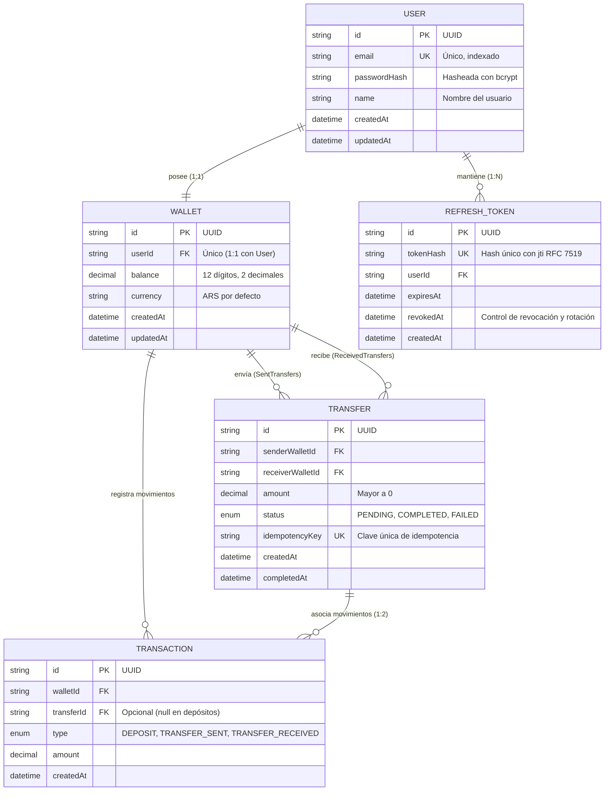
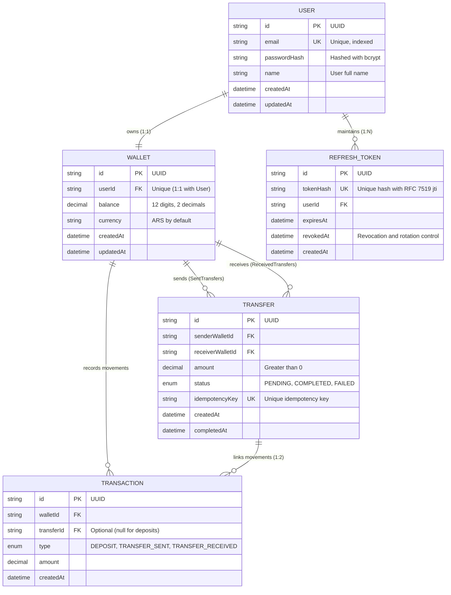

# 💳 MiniPay — Wallet API

> **[Español](#-español)** | **[English](#-english)**

---

## 🇪🇸 Español

API RESTful para una **Billetera Digital con Dinero Ficticio**, desarrollada como Proyecto Integrador Backend de nivel producción utilizando **NestJS**, **TypeScript**, **PostgreSQL** y **Prisma ORM**.

El sistema implementa operaciones financieras de alta concurrencia garantizando **Consistencia ACID**, **Atomicidad Transaccional**, **Idempotencia de Peticiones**, **Paginación con Metadatos**, **Filtros Globales de Seguridad y Sanitización**, y **Autenticación JWT con Rotación de Tokens**.

---

### 🚀 Stack Tecnológico

| Componente | Tecnología | Descripción |
| :--- | :--- | :--- |
| **Framework** | [NestJS 11](https://nestjs.com/) | Arquitectura modular desacoplada con Inyección de Dependencias |
| **Lenguaje** | [TypeScript](https://www.typescriptlang.org/) | Tipado estricto en tiempo de compilación |
| **Base de Datos** | [PostgreSQL 16](https://www.postgresql.org/) | Base de datos relacional ACID ejecutada en Docker |
| **ORM** | [Prisma 7](https://www.prisma.io/) | Con `@prisma/adapter-pg` y pool de conexiones `pg` |
| **Seguridad** | Passport JWT, bcrypt, Helmet, CORS, Throttler | Hashing seguro (10 rondas), cabeceras HTTP, rate limiting |
| **Serialización** | ClassSerializer & Sanitizer | Depuración automática y recursiva de contraseñas |
| **Documentación** | OpenAPI 3.0 / Swagger UI | Explorador interactivo en `/api/docs` |
| **Testing** | Jest + Supertest | Suite de pruebas de integración End-to-End (29/29 tests) |
| **Gestor de Paquetes** | [pnpm](https://pnpm.io/) | Rápido y eficiente en espacio de disco |

---

### 🏛️ Arquitectura y Modelo de Datos



---

### 🧠 Decisiones Técnicas y Desafíos Resueltos

#### 1. Atomicidad Transaccional en Transferencias (`prisma.$transaction`)
- El débito del remitente (`balance: { decrement: amount }`), el crédito del destinatario (`balance: { increment: amount }`), el registro `Transfer` y los dos asientos en `Transaction` (`TRANSFER_SENT` y `TRANSFER_RECEIVED`) se ejecutan dentro de una **transacción interactiva atómica**.
- Si cualquiera de los pasos falla o el saldo resulta insuficiente, se ejecuta un **Rollback automático**.

#### 2. Sistema de Idempotencia (`Idempotency-Key`)
- El endpoint `POST /transfers` acepta la cabecera `Idempotency-Key`.
- Si la red reintenta una petición con la misma clave y los mismos datos, devuelve inmediatamente el resultado de la transferencia previa **sin duplicar el débito**.
- Reutilizar una clave previa con datos diferentes es rechazado con `400 Bad Request`.

#### 3. Autenticación y Rotación de Refresh Tokens (RFC 7519)
- Contraseñas protegidas con **bcrypt (10 rondas de salt)**.
- Respuestas genéricas (`Credenciales inválidas`) para evitar la enumeración de usuarios.
- **Rotación estricta de Refresh Tokens**: Al renovar la sesión (`POST /auth/refresh`), se revoca el token anterior (`revokedAt: new Date()`) y se emite un nuevo par de tokens con un identificador único `jti` (`crypto.randomUUID()`).

#### 4. Paginación y Filtros con Metadatos
- Los historiales `GET /transfers` y `GET /wallet/transactions` aceptan parámetros de consulta (`?page=1&limit=10&type=...&status=...`).
- Devuelven una envoltura estándar:
  ```json
  {
    "data": [ ... ],
    "meta": {
      "total": 25,
      "page": 1,
      "limit": 10,
      "totalPages": 3,
      "hasNextPage": true,
      "hasPreviousPage": false
    }
  }
  ```

#### 5. Filtro Global de Excepciones y Sanitización de Datos
- **`AllExceptionsFilter`**: Normaliza todos los errores en un esquema consistente (`statusCode`, `timestamp`, `path`, `method`, `message`, `error`) y sanitiza errores 500 en producción.
- **`ClassSerializerInterceptor` & `SanitizeResponseInterceptor`**: Depuración recursiva que garantiza que ningún hash de contraseña se exponga en las respuestas HTTP.

#### 6. Gestión de Perfil y Cierre de Sesiones
- `GET /users/me`: Consulta de perfil y billetera sin credenciales.
- `POST /users/change-password`: Valida contraseña actual, hashea la nueva y revoca automáticamente todos los tokens activos previos para invalidar sesiones antiguas.

---

### 📡 Referencia de Endpoints

| Método | Endpoint | Descripción | Autenticación / Cabeceras |
| :--- | :--- | :--- | :--- |
| `GET` | `/health` | Chequeo de estado de la API | Público |
| `POST` | `/auth/register` | Registro de usuario y creación de billetera | Público (5 req/min) |
| `POST` | `/auth/login` | Inicio de sesión y emisión de tokens | Público (5 req/min) |
| `POST` | `/auth/refresh` | Rotación de Refresh Token | Público |
| `POST` | `/auth/logout` | Revocación de Refresh Token | Público |
| `GET` | `/users/me` | Obtener perfil del usuario autenticado | `Bearer JWT` |
| `POST` | `/users/change-password` | Cambio seguro de contraseña y revocación de sesiones | `Bearer JWT` |
| `GET` | `/wallet` | Consultar saldo y datos de la billetera | `Bearer JWT` |
| `POST` | `/wallet/deposit` | Depositar dinero ficticio | `Bearer JWT` |
| `GET` | `/wallet/transactions` | Historial de transacciones paginado y con filtros | `Bearer JWT` (`?page`, `?limit`, `?type`) |
| `POST` | `/transfers` | Ejecutar transferencia de dinero | `Bearer JWT`, `Idempotency-Key` |
| `GET` | `/transfers/:id` | Consultar detalle de una transferencia | `Bearer JWT` (Solo participantes) |
| `GET` | `/transfers` | Historial de transferencias paginado y con filtros | `Bearer JWT` (`?page`, `?limit`, `?status`) |

---

### 🛠️ Instalación y Puesta en Marcha

```bash
# 1. Instalar dependencias
pnpm install

# 2. Iniciar PostgreSQL y Adminer en Docker
docker compose up -d

# 3. Ejecutar migraciones de Prisma
pnpm dlx prisma migrate dev

# 4. (Opcional) Poblar base de datos con usuarios y transferencias de prueba
pnpm db:seed

# 5. Iniciar servidor en desarrollo
pnpm start:dev
```

- **API Base:** `http://localhost:3000`
- **Swagger UI:** `http://localhost:3000/api/docs`
- **Adminer:** `http://localhost:8080` (Sistema: `PostgreSQL`, Servidor: `postgres:5432`, Usuario: `minipay`, Base: `minipay`)

#### 🔑 Credenciales de Prueba Precargadas (`pnpm db:seed`)
- **Lucas Dev:** `lucas@minipay.com` / `Password123!` (Saldo: $20.000 ARS)
- **Juan Perez:** `juan@minipay.com` / `Password123!` (Saldo: $15.000 ARS)
- **Maria Gomez:** `maria@minipay.com` / `Password123!` (Saldo: $5.000 ARS)

---

### 🧪 Pruebas Automatizadas E2E

```bash
pnpm test:e2e
```
*Resultados: **29/29 tests pasando al 100%** en suites `app`, `auth`, `wallet`, `transfer` y `user`.*

---

<br>

---

## 🇺🇸 English

RESTful API for a **Virtual Wallet System with Simulated Currency**, built as an enterprise-ready Backend Capstone Project using **NestJS**, **TypeScript**, **PostgreSQL**, and **Prisma ORM**.

The platform processes high-concurrency financial operations with **ACID Consistency**, **Atomic Database Transactions**, **Request Idempotency**, **Pagination & Metadata Filters**, **Global Exception Normalization**, and **Secure JWT Authentication with Refresh Token Rotation**.

---

### 🚀 Tech Stack

| Component | Technology | Description |
| :--- | :--- | :--- |
| **Framework** | [NestJS 11](https://nestjs.com/) | Modular architecture with Dependency Injection |
| **Language** | [TypeScript](https://www.typescriptlang.org/) | Strict type safety and compilation |
| **Database** | [PostgreSQL 16](https://www.postgresql.org/) | ACID-compliant relational DB in Docker container |
| **ORM** | [Prisma 7](https://www.prisma.io/) | With `@prisma/adapter-pg` and `pg` connection pool |
| **Security** | Passport JWT, bcrypt, Helmet, CORS, Throttler | Bcrypt hashing (10 rounds), HTTP headers, rate limiting |
| **Serialization** | ClassSerializer & Sanitizer | Automatic and recursive redaction of sensitive credentials |
| **Documentation** | OpenAPI 3.0 / Swagger UI | Interactive API explorer mounted at `/api/docs` |
| **Testing** | Jest + Supertest | End-to-End integration test suite (29/29 tests) |
| **Package Manager** | [pnpm](https://pnpm.io/) | Fast, disk space efficient package manager |

---

### 🏛️ Database Architecture & Entity Relationships



---

### 🧠 Core Architectural Decisions & Design Patterns

#### 1. Atomic Database Transactions (`prisma.$transaction`)
- Sender balance deduction (`decrement`), recipient balance credit (`increment`), `Transfer` record creation, and ledger entries (`TRANSFER_SENT`, `TRANSFER_RECEIVED`) are executed inside a single **interactive database transaction**.
- An automatic **Rollback** is triggered if any intermediate operation fails, preventing ledger inconsistencies or fund losses.

#### 2. Request Idempotency Handling (`Idempotency-Key`)
- The `POST /transfers` endpoint extracts the `Idempotency-Key` header.
- Repeating a request with the same key and payload returns the previous transfer result **without debiting balances again**.
- Reusing an existing key with different parameters is rejected with `400 Bad Request`.

#### 3. Authentication & Refresh Token Rotation (RFC 7519)
- Passwords are securely hashed with **bcrypt (10 salt rounds)**.
- User enumeration attacks are mitigated by returning generic `Invalid credentials` error messages on login failures.
- **Strict Token Rotation**: Each refresh token can only be used once. Token exchange revokes the existing token (`revokedAt: new Date()`) and generates a new pair containing unique UUID `jti` claims (`crypto.randomUUID()`).

#### 4. Pagination & Query Filters with Metadata
- Historial endpoints (`GET /transfers` and `GET /wallet/transactions`) accept query parameters (`?page=1&limit=10&type=...&status=...`).
- Responses follow a standardized envelope:
  ```json
  {
    "data": [ ... ],
    "meta": {
      "total": 25,
      "page": 1,
      "limit": 10,
      "totalPages": 3,
      "hasNextPage": true,
      "hasPreviousPage": false
    }
  }
  ```

#### 5. Global Exception Filtering & Response Sanitization
- **`AllExceptionsFilter`**: Normalizes all error responses into a consistent JSON format (`statusCode`, `timestamp`, `path`, `method`, `message`, `error`) and redacts 500 error stack traces in production.
- **`ClassSerializerInterceptor` & `SanitizeResponseInterceptor`**: Global interceptors ensuring password hashes are scrubbed before reaching the network.

#### 6. User Profile Management & Session Termination
- `GET /users/me`: Retrieves authenticated user profile and wallet information.
- `POST /users/change-password`: Verifies current credentials, hashes new password, and revokes all active refresh tokens in an atomic transaction to terminate previous sessions.

---

### 📡 API Endpoints Reference

| Method | Endpoint | Description | Auth / Headers |
| :--- | :--- | :--- | :--- |
| `GET` | `/health` | Liveness and readiness health probe | Public |
| `POST` | `/auth/register` | Register user and initialize wallet | Public (5 req/min) |
| `POST` | `/auth/login` | Authenticate user & issue tokens | Public (5 req/min) |
| `POST` | `/auth/refresh` | Rotate refresh token | Public |
| `POST` | `/auth/logout` | Revoke active refresh token | Public |
| `GET` | `/users/me` | Retrieve authenticated user profile & wallet | `Bearer JWT` |
| `POST` | `/users/change-password` | Update password & revoke existing sessions | `Bearer JWT` |
| `GET` | `/wallet` | Retrieve balance and wallet info | `Bearer JWT` |
| `POST` | `/wallet/deposit` | Deposit simulated funds | `Bearer JWT` |
| `GET` | `/wallet/transactions`| View paginated transaction history | `Bearer JWT` (`?page`, `?limit`, `?type`) |
| `POST` | `/transfers` | Execute money transfer | `Bearer JWT`, `Idempotency-Key` |
| `GET` | `/transfers/:id` | View specific transfer details | `Bearer JWT` (Participants only) |
| `GET` | `/transfers` | List paginated sent/received transfers | `Bearer JWT` (`?page`, `?limit`, `?status`) |

---

### 🛠️ Getting Started

```bash
# 1. Install dependencies
pnpm install

# 2. Start PostgreSQL and Adminer via Docker
docker compose up -d

# 3. Run Prisma migrations
pnpm dlx prisma migrate dev

# 4. (Optional) Populate database with test seed data
pnpm db:seed

# 5. Start local development server
pnpm start:dev
```

- **API Base:** `http://localhost:3000`
- **Swagger Documentation:** `http://localhost:3000/api/docs`
- **Adminer:** `http://localhost:8080` (System: `PostgreSQL`, Server: `postgres:5432`, Username: `minipay`, Database: `minipay`)

#### 🔑 Preloaded Test Credentials (`pnpm db:seed`)
- **Lucas Dev:** `lucas@minipay.com` / `Password123!` (Balance: $20,000 ARS)
- **Juan Perez:** `juan@minipay.com` / `Password123!` (Balance: $15,000 ARS)
- **Maria Gomez:** `maria@minipay.com` / `Password123!` (Balance: $5,000 ARS)

---

### 🧪 Automated E2E Tests

```bash
pnpm test:e2e
```
*Results: **29/29 passing tests (100% PASS across all 5 test suites)**.*
